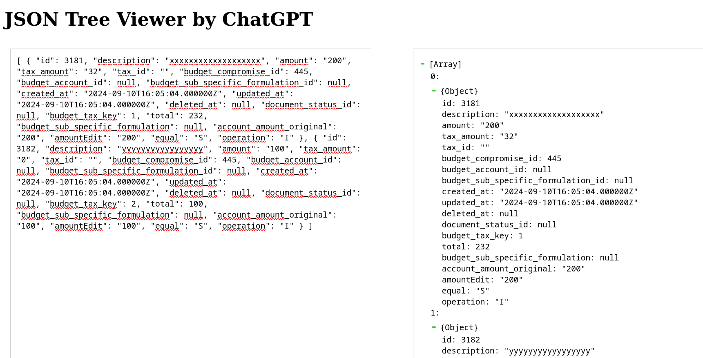

# JSON Tree Viewer

Este proyecto es una implementación en HTML, CSS y JavaScript que permite
visualizar de manera jerárquica un objeto JSON. Cada dato dentro de otro se
representa como una rama de un árbol, permitiendo expandir o contraer dichas
ramas para facilitar su inspección y mejorar la visualización de la estructura
completa. Sirve sin conexión a internet.

-Creado con ChatGPT

-Inspirado en: Online JSON Viewer and Formatter > https://jsonviewer.stack.hu/

-Pruébalo aquí: https://argenisosorio.github.io/JSON_Tree_Viewer/

## Capturas

